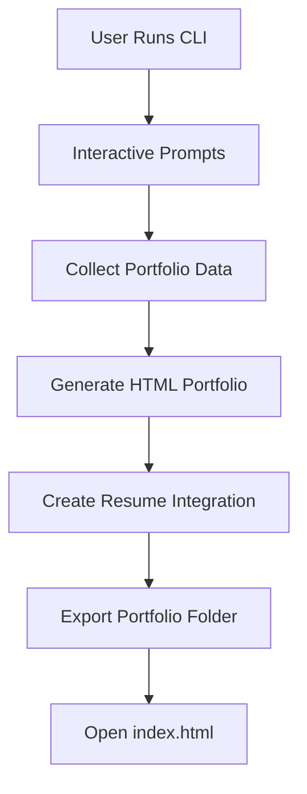
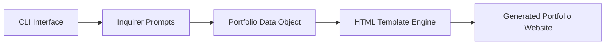
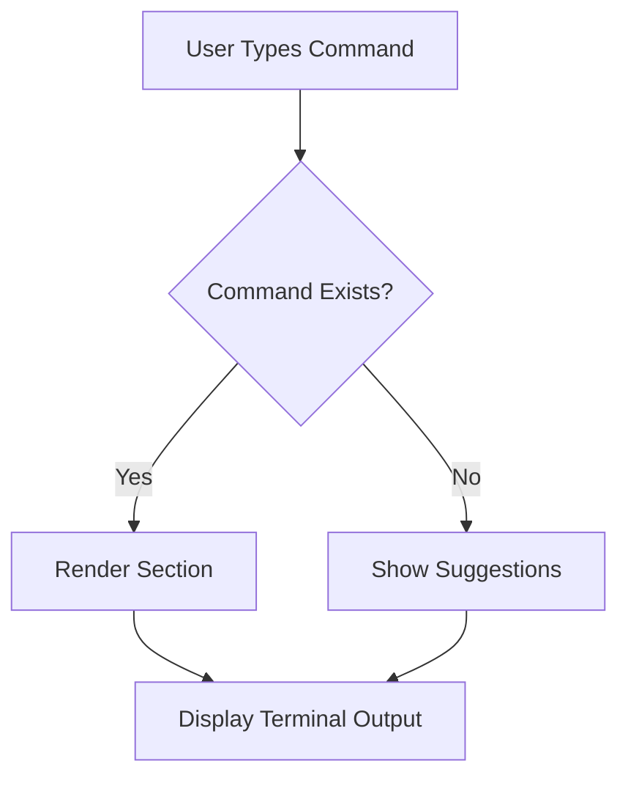

# 🚀 satya-portfolio-cli


Generate hacker-style terminal portfolio websites directly from your CLI.

---

## ⚡ Features

- Interactive terminal portfolio
- Dynamic commands
- Hacker-style UI
- Resume support
- Smart command suggestions
- Dynamic projects, skills, certifications, education
- Personalized shell identity
- ASCII branding using figlet
- Supports local resume PDF or resume URL
- Fully generated static portfolio website

---

## 📦 Installation

Run instantly using:

```bash
npx satya-portfolio-cli
```

OR install globally:

```bash
npm install -g satya-portfolio-cli
```

---

## 🖥️ Commands Supported

Inside generated portfolio:

```bash
help
about
skills
projects
experience
education
certs
contact
resume
whoami
clear
```

---

## ✨ Example

```bash
? Your name: Satya
? Terminal username: neo
? Terminal hostname: matrix
? Skills: React, FastAPI, Node.js
```

Generates:

```txt
neo@matrix:~ ❯
```

Interactive terminal portfolio website.

---

## ⚙️ Workflow



---

## 🏗️ Architecture Diagram



---

## 💻 Terminal Command Flow



---

## ⚙️ How It Works

```txt
npx satya-portfolio-cli
        ↓
Interactive CLI prompts
        ↓
Portfolio data collection
        ↓
HTML template generation
        ↓
Interactive terminal portfolio website
```

---

## 📁 Generated Structure

```txt
portfolio/
 ├── index.html
 └── resume.pdf
```

---

## 🔥 Screenshots

### Terminal Portfolio Preview


---

## 🛠️ Tech Stack

- Node.js
- Inquirer.js
- Chalk
- Figlet
- fs-extra

---

## 🚀 Publish Your Portfolio

After generation:

- Open `portfolio/index.html`
- Deploy using:
  - GitHub Pages
  - Netlify
  - Vercel

---

## 🚧 Roadmap

- [x] Interactive terminal portfolio
- [x] Resume support
- [x] Smart command suggestions
- [x] Dynamic portfolio generation
- [ ] Multiple themes
- [ ] One-click deployment
- [ ] AI resume-to-portfolio generation
- [ ] Live preview mode

---

## 📌 npm Package

```bash
npm install -g satya-portfolio-cli
```

OR

```bash
npx satya-portfolio-cli
```

---

## 👨‍💻 Author

Satyavardhan Koyalkar

GitHub:
https://github.com/satyavardhankoyalkar

LinkedIn:
https://www.linkedin.com/in/satyavardhan-koyalkar-5ba794/

---

## ⭐ Support

If you like this project:

- Star the repo
- Share it
- Build cool portfolios 😎

---

## 📄 License

MIT License
